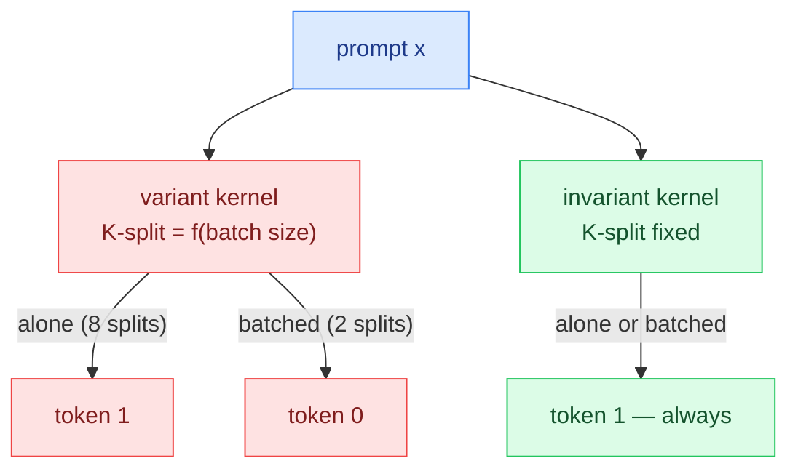

# batch-invariant

**A prompt's answer must not depend on who else is in the batch — here's the bug
that breaks that, and a kernel that provably fixes it.**

Run a model twice on the same prompt with greedy decoding and you expect the same
token. In a batched inference server you don't always get it: the output can
change depending on **what else was being decoded alongside it** — not from
temperature, but because the *reduction order* inside a batched matmul shifted
with the batch shape. This repo shows that failure as a concrete **token flip**,
then fixes it and proves the fix over thousands of batches.

> It's a systems-correctness property most applied-AI work never checks: the same
> "the answer is a pure function of the input, not the schedule" discipline behind
> [deterministic-sim-testing](https://github.com/parag-labs/deterministic-sim-testing),
> applied to LLM inference.

```
$ batch-invariant demo
A single prompt, decoded two ways.

  variant    alone -> token 1   in a batch of 4 -> token 0  <-- same prompt, DIFFERENT token
  invariant  alone -> token 1   in a batch of 4 -> token 1  (stable)
```

---

## Why it happens

A matmul output is a sum over the K dimension, and in floating point the *order*
of that sum changes the last bits — more than the last bits when large terms
nearly cancel. Real kernels don't sum left-to-right; they **split the reduction
into chunks and combine partial sums**, and how many chunks is often chosen from
the batch shape (split K further when the batch is small, to keep every core
busy). So a row's rounding depends on its batch-mates. Occasionally that lands
exactly between two tokens' logits and the **argmax flips** — the same prompt
decodes to a different token.



## The fix

Make the reduction order a property of the *problem*, not of the *batch*.
`matmul_invariant` reduces every dot product with a **fixed** grouping regardless
of batch size, so a row's output is a pure function of that row and the weights —
bit-identical whether it runs alone or alongside a thousand others. The tests
assert exactly that, over thousands of random batch compositions, and the
constructed flip case shows the token that moved under the variant kernel staying
put under the invariant one.

## Use it

```bash
pip install -e ".[dev]"
pytest -q                 # 8 tests: invariance holds, variant breaks, token flips

batch-invariant demo      # show the flip under the variant kernel, gone under the invariant one
batch-invariant check     # stress: invariant kernel is batch-independent across 5000 batches
```

In code:

```python
from batch_invariant import matmul_invariant, flip_case, argmax, logits_alone, logits_in_batch

model, x, others = flip_case()
# variant: token depends on the batch; invariant: it doesn't
assert argmax(logits_alone(model, x, invariant=True)) == \
       argmax(logits_in_batch(model, x, others, invariant=True))
```

## Six languages, one algorithm

The pure-logic core — the float reductions, the variant vs invariant matmul, the
toy decode step, and the constructed flip case — is implemented **identically in
six languages**, each with its own idiomatic test suite. Every port reduces in the
same order and produces bit-identical logits, so the invariance property holds the
same way everywhere.

| Language   | Location   | Tests |
|------------|------------|-------|
| Python     | `src/`     | 8     |
| Go         | `go/`      | 24    |
| Rust       | `rust/`    | 25    |
| C#         | `csharp/`  | 30    |
| Java       | `java/`    | 30    |
| TypeScript | `ts/`      | 30    |

**What the ports cover.** They mirror the deterministic algorithmic core:

- `kernels` — `sum_flat`, `sum_split`, `splits_for_batch`, and the variant /
  invariant matmuls (`FIXED_SPLITS = 4`).
- `server` — the toy `Model`, `logits_alone`, `logits_in_batch`, `argmax`
  (first-wins on ties), and `token_depends_on_batch`.
- `flip_case` — the deterministic token-flip fixture. Python builds it from a
  seeded `random.Random(514)`; the ports embed the *exact* weights and inputs it
  produces as round-trip-safe constants rather than re-implementing CPython's
  Mersenne Twister, so all six agree bit-for-bit.

Deliberately **excluded**: the `cli` argparse layer (IO glue) and re-deriving the
seeded RNG. Those aren't part of the correctness property.

Run any port from its directory:

```bash
cd go   && go test ./...
cd rust && cargo test
cd csharp/tests && dotnet test
cd java && mvn -q test
cd ts   && npm install && npm test
```

## Design decisions

- **Explicit float reductions, no numpy** — so the reduction order is exactly what
  the code says, making both the bug and the fix legible and testable.
- **A realistic variant heuristic** — "split K more when the batch is small" is a
  genuine load-balancing instinct, which is what makes it a fair cautionary tale.
- **A deterministic constructed flip** — token flips are rare (two logits tied
  within the reduction's rounding), so it's reproduced from a fixed seed rather
  than pretended common. Rare isn't good enough for a reproducibility guarantee.

Non-goals (not a GPU kernel, not hardware nondeterminism, not a full attention
stack) and the mechanism in full are in [DESIGN.md](DESIGN.md).

## Layout

```
batch-invariant/
├── src/batch_invariant/
│   ├── kernels.py     # sum_flat / sum_split, and the variant vs invariant matmul
│   ├── server.py      # a toy decode step (logits -> argmax token)
│   ├── demo_data.py   # the deterministic token-flip case
│   └── cli.py         # demo / check
├── tests/             # 8 tests: invariance, variant breakage, the token flip
├── go/                # Go port + go test suite
├── rust/              # Rust port + cargo test suite
├── csharp/            # C# port (src/ + tests/, xUnit)
├── java/              # Java port (Maven, JUnit 5)
└── ts/                # TypeScript port + vitest suite
```

## Reference

The batch-invariance problem was crisply framed by Thinking Machines' *Defeating
Nondeterminism in LLM Inference* (2025); this is a small, self-contained
reconstruction of the core mechanism and its fix.

## License

MIT — see [LICENSE](LICENSE).
